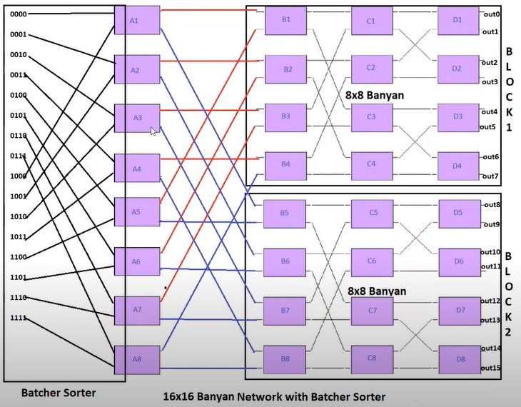
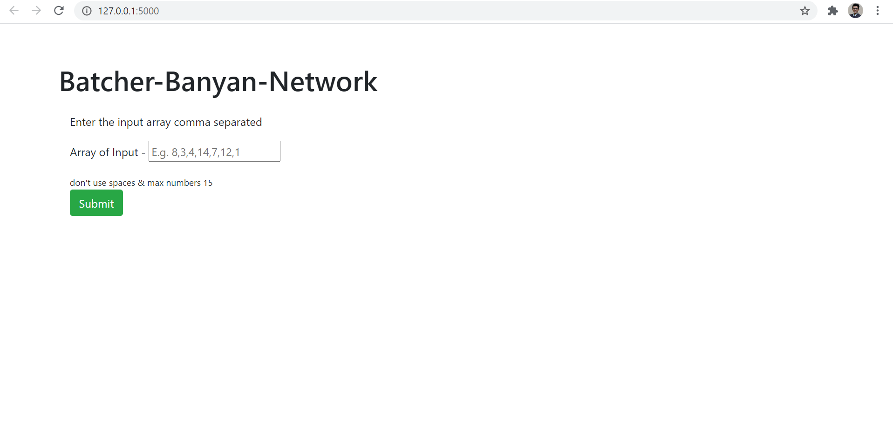
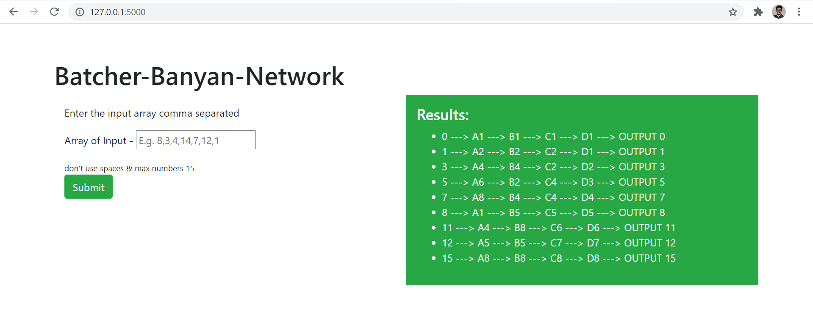
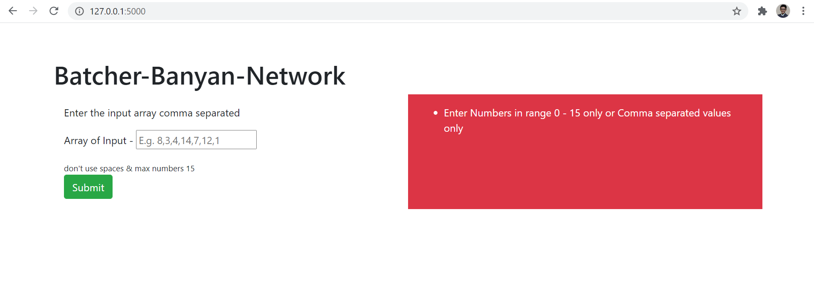

# Project 2 Batcher-Banyan-Network

IFT 510 Principles of Computer Information and Technology Architecture - Project Assignment 2 Submission

Test the app [here](https://batcher-banyan-network.herokuapp.com/) - https://batcher-banyan-network.herokuapp.com/ 

## Question
Create a computer program in the language of your choice that emulates a Banyan-Batcher-Network with 8x8 Inputs & Outputs. Then scale the output to 16x16 Delta Network. Use a random generator with 8 or 16 options to emulate the input table routing list with the assigned input port. Show that your simulation works for all inputs and outputs. Explain how your routing fabric changes when you have 16 inputs and outputs.

Make a video presentation that demonstrates how your network works. Submission - a youtube video link or MP4 file

## Deliverables
- Develop the expected values of any tests conducted that demonstrate how your program functions
  * The testing was done manually by first doing it on paper and then comparing the values generated by this program and our initial values 
- Provide a copy of your source code
  * Please check my [Github Repo](https://github.com/imeetsanghvi/batcher-banyan-network) for more details
- Provide a sequence of screenshots in the video to demonstrate the simulation and how the network works for all inputs and outputs (0-7). Ensure to separate the batcher sorter from the banyan network and how they work in conjunction
  * everything is explained and demonstrated in detail in the video [here](https://youtu.be/crPVfbQqSe4)
- Provide a detailed discussion of results, and the concepts you used in developing the program. Discussions should include analysis and a comparison of the results with the expected value from the theory.
  * Explained thoroughly in video
- Present the results in the [video](https://youtu.be/crPVfbQqSe4) file and submit 

## Explanation
A Banyan network could essentially route any input to any out but in case of conflicts at any particular intermediate state would result in the loss of packets which are being passed through. To avoid this packet loss in the delta network we sort the input first before passing it to the banyan(delta) network which then correctly finds the path for each packet and routes them. 

The main logic is to 
1. take the user input (a list of numbers)
2. This input goes through the batcher network first which basically sorts the input according to the desired locations for the banyan network.
3. Get the binary values of each data
4. At each column state A|B|C|D implement a switching pattern to find out the route that each packet will take
    1. for example - if the packet is 4 ==> 0100
    2. then 4 will first go to A5 as seen in the image below
    from A5 if the first value of binary is 0 goto B1 else B5
   3. Similarly, from B1 we check the binary value (0100 - 2nd column) if value is 0 go to c1 else c3
    in this way once we traverse through the switches we will be able to reach the destination output port correctly
      

### Strengths of this code
1. It takes dynamic user input upto 15 numbers
2. Handles any input >= 0 and <= 15
3. Returns error if number not in range or if the input is not according to the format (check image 3 in the output section below)
### Weakeness of this code
1. we cannot go higher order yet, 32 bit or higher implementation not handled
## How to run this Flask Code
1. The main logic is implemented inside bbn.py inside the main function
2. first clone ths repo using this command
   > git clone https://github.com/imeetsanghvi/batcher-banyan-network.git 
3. go into the new directory 
   > cd batcher-banyan-network
4. Install the requirements
    > pip install requirements.txt
5. Now execute from the terminal inside the folder
   > python app.py 
## How to use the bbn.py (batcher banyan netowrk.py)
The bbn.py is the main logic file which contains the control/logic of the app.py
It contains three main things
1. The Packet Class
   
        class Packet:
        # init method or constructor
        def __init__(self, data: int):
            self.data = data
            self.bin = "{0:04b}".format(data)
            self.path = []
   
2. The batcher-network
   * This function takes input the list/sequence of numbers provided by the user
    * sorts the input
    * and finally create an object of the packet class by initializing each item in list as a packet 
    all the items ==> are converted to a packet obejct and now a [list of packets] is returned
      
3. The Banyan-network
    * The banyan network find the path for each packet from input to output. 
    * the path of each packet is stored in itself packet.path
    * packet.bin represted the tag which is added to the packet before it enters the delta network and this tag is removed before it leaves the delta network at the final stage
## Output 
Image 1 - Input Options (default state load)

Image 2 - Correct Output

Image 3 - Output if there is an error in input

